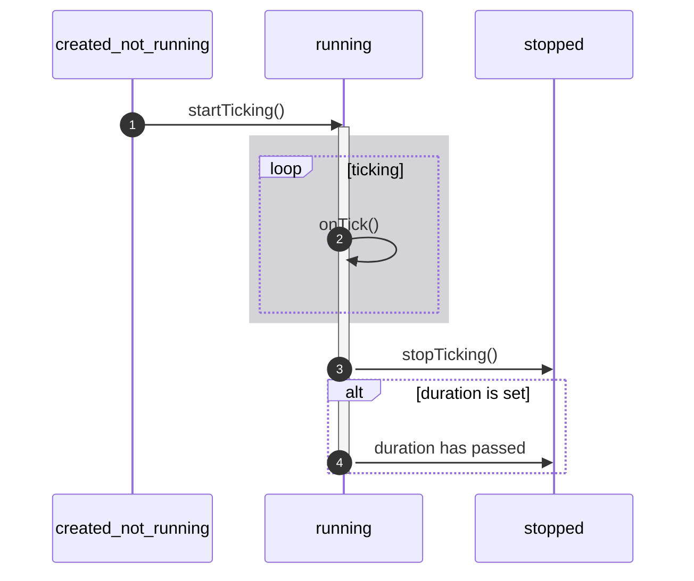

# r3bl-ts-utils npm package

<!-- START doctoc generated TOC please keep comment here to allow auto update -->
<!-- DON'T EDIT THIS SECTION, INSTEAD RE-RUN doctoc TO UPDATE -->

- [Overview](#overview)
- [Colorized console](#colorized-console)
- [Scope functions](#scope-functions)
  - [`_also`](#_also)
  - [`_alsoAsync`](#_alsoasync)
  - [`_then`](#_then)
  - [`_let`](#_let)
  - [`_apply`](#_apply)
  - [`_with`](#_with)
- [Misc utils](#misc-utils)
- [React utils](#react-utils)
  - [`makeReactElementFromArray()`](#makereactelementfromarray)
- [React Ink Hook utils](#react-ink-hook-utils)
  - [`useClock()`](#useclock)
  - [`useClockWithLocalTimeFormat()`](#useclockwithlocaltimeformat)
  - [`useKeyboard()`](#usekeyboard)
  - [`useKeyboardWithMap()`](#usekeyboardwithmap)
  - [`useTTYSize()`](#usettysize)
- [React Hook utils](#react-hook-utils)
  - [`StateHook<T>`](#statehookt)
  - [`useForceUpdateFn()`](#useforceupdatefn)
  - [`_withRef()`](#_withref)
- [Timer utils](#timer-utils)
- [Cache utils](#cache-utils)
- [Build, test, and publish this package](#build-test-and-publish-this-package)
  - [Build, format, test](#build-format-test)
  - [Publish to npm](#publish-to-npm)
  - [Bump a package version (patch)](#bump-a-package-version-patch)
- [IDEA configuration](#idea-configuration)
- [VSCode settings](#vscode-settings)
- [References](#references)

<!-- END doctoc generated TOC please keep comment here to allow auto update -->

## Overview

The `r3bl-ts-utils` package is a set of useful TypeScript functions and classes that can be used in
Node.js and browser environments. The following groups of functionality are provided in this
package.

1. [Powerful colorized console output](#colorized-console) inspired by the [color-console][o-3]
   library (written in Kotlin).
2. [Scope functions](#scope-functions) inspired by [Kotlin stdlib scope functions][o-4] (`_also`,
   `_let`, `_apply`, `_with`).
3. [Misc utilities](#misc-utils), eg an async `sleep` function that makes introduce fancy formatted
   delays in your code.
4. [React Hook utilities](#react-hook-utils), some of which are in the style of the Kotlin scope
   functions, that are designed to make it easier to work with React Hooks and functional
   components.
5. [Timer utilities](#timer-utils) that are easier and more robust to work w/ than `setInterval()`.
   These can be used to perform any recurring tasks that are on a fixed interval timer.

This module is written entirely in TypeScript, and is configured to be a CommonJS module.

> 💡 Here's more information on CommonJS, ESM, and hybrid modules.
>
> - [How to createCache dual modules][mod-1].
> - [Example of a dual module][mod-2].

<!-- prettier-ignore-start -->

[mod-1]: https://www.sensedeep.com/blog/posts/2021/how-to-create-single-source-npm-module.html

[mod-2]: https://github.com/sensedeep/dynamodb-onetable
<!-- prettier-ignore-end -->

To install the package, simply run the following in the top level folder of your project.

```shell
npm i r3bl-ts-utils
```

> For more information on how this package was created, or to facilitate a deep dive of the code
> written here, please read the [Node.js w/ TypeScript handbook][o-5] on developerlife.com.

Here are some important links for this package.

1. [Github repo][o-1]
2. [npm package][o-2]

<!-- prettier-ignore-start -->

[o-1]: https://github.com/r3bl-org/r3bl-ts-utils

[o-2]: https://www.npmjs.com/package/r3bl-ts-utils

[o-3]: https://github.com/nazmulidris/color-console

[o-4]: https://kotlinlang.org/docs/scope-functions.html

[o-5]: https://developerlife.com/2021/07/02/nodejs-typescript-handbook/
<!-- prettier-ignore-end -->

## Colorized console

Let's look at how to use this by example. You can browse the source [here][cc-1].

You can simply colorize existing `console.log` and `console.error`, like this using the default
styles that are provided in `Styles`.

```typescript
import { printHeader, Styles } from "r3bl-ts-utils"

printHeader(`Example 1`)
console.log(Styles.Primary(`Wrote file successfully. 👍`))
console.error(Styles.Secondary(`Failed to write file! ⛔`))
```

To override on the default styles, here's an example. The [`chalk`][cc-2] library is used under the
hood, so you can use all it's styling rules, objects, functions, and classes.

<!-- prettier-ignore-start -->

[cc-1]: https://github.com/r3bl-org/r3bl-ts-utils/blob/main/src/color-console-utils.ts

[cc-2]: https://www.npmjs.com/package/chalk
<!-- prettier-ignore-end -->

```typescript
import { printHeader, Styles } from "r3bl-ts-utils"

printHeader(`Example 2`)
console.log(Styles.Primary.blue(`Wrote file successfully. 👍`))
console.error(Styles.Secondary.red.bgBlack(`Failed to write file! ⛔`))
```

Here's how you can use the `ColorConsole` class to do more powerful things.

```typescript
import { printHeader, Styles, ColorConsole } from "r3bl-ts-utils"

printHeader(`Example 3`)
const myColorConsole = ColorConsole.create(chalk.bold.yellow.bgBlack)
myColorConsole(/* text: */ `Start log output...`).consoleLog()

const count = 4
while (count-- > 0) {
  ColorConsole.create(Styles.Primary.red)(`While loop output: ${count}`).consoleLogInPlace()
}

ColorConsole.create(Styles.Primary.blue)(/* text: */ `End log output...`).consoleLog(
  /* prefixWithNewLine: */ true
)
```

> Note that once created, using `create()`, you can simply call that instance w/out passing a
> method. This happens because the `create()` factory method creates a new `ColorConsole` object,
> which also implements the `ColorConsoleIF` interface, which is callable) by providing a
> `(text: string)` signature that binds to the `call(text: string)` method.

If you don't deviate from the `Primary` and `Secondary` styles, then you can simply use some default
`ColorConsole` instances that have been created for you like this.

```typescript
import { printHeader, Styles, ColorConsole, StyledColorConsole } from "r3bl-ts-utils"
import * as _ from "lodash"

printHeader(`Example 4`)
const data = { foo: "foo_value", bar: "bar_value" }
for (const key in data) {
  StyledColorConsole.Primary(
    Styles.Primary(key) + " -> " + Styles.Secondary(_.get(data, key))
  ).consoleLog()
}
```

## Scope functions

The scope functions mimic Kotlin's `stdlib` scope functions (`also`, `let`, `apply`, `with`) one to
one. So here are four examples of using them. You can browse the source [here][sf-1].

> The [tests][sf-2] for this library are worth taking a look at to get a sense of how to use them.

<!-- prettier-ignore-start -->

[sf-1]: https://github.com/r3bl-org/r3bl-ts-utils/blob/main/src/kotlin-lang-utils.ts

[sf-2]: https://github.com/r3bl-org/r3bl-ts-utils/tree/main/src/__tests
<!-- prettier-ignore-end -->

### `_also`

[`_also()`][sf-1] takes a `contextObject`, passes it to the `ReceiverFn`, and returns the
`contextObject`. Here's an example.

```typescript
import { _also } from "r3bl-ts-utils"

const spans = _also(new Array<string>(3), (spans: string[]) => {
  spans[0] = "one"
  spans[1] = "two"
  spans[2] = "three"
})
const output = spans.join(", ")
console.log(output)
```

> You can name the argument to the `ReceiverFn` anything you like and not just `it` (which is the
> common practice in Kotlin).

### `_alsoAsync`

[`_alsoAsync()`][sf-1] is not part of Kotlin's `stdlib` scope functions, but it behaves similarly to
`_also()` except that it accepts an async receiver function (`ReceiverFnAsync`). And it returns the
`contextObject` and a promise from the async receiver function. Here's an example.

```tsx
import { _alsoAsync } from "r3bl-ts-utils"

const contextObject = "_alsoAsync"

let flag = false

// https://developer.mozilla.org/en-US/docs/Web/JavaScript/Reference/Statements/async_function
const asyncFn: ReceiverFnAsync<string, boolean> = async (it) =>
  new Promise<boolean>((resolveFn) => {
    const _fun = () => {
      expect(it).toEqual(contextObject)
      flag = true
      resolveFn(true)
    }
    // Delay execution of _fun to next iteration of event loop.
    // https://nodejs.dev/learn/understanding-setimmediate
    setImmediate(_fun)
  })

const { contextObject: obj, promiseFromReceiverFn: promise } = _alsoAsync(contextObject, asyncFn)

expect(obj).toEqual(contextObject)
expect(flag).toBeFalsy()

const value = await promise
expect(value).toBeTruthy()
expect(flag).toBeTruthy()
```

### `_then`

[`_then()`][sf-1] is not part of Kotlin's `stdlib` scope functions, but it behaves similarly to
`_also()`, except that it takes an array of receiver functions (each of which accepts a
`contextObject` argument), and runs them all sequentially. It returns `contextObject` just like
`_also()`. Here's an example.

```tsx
import { _then } from "r3bl-ts-utils"

const buffer = ""
const fun1: ReceiverFn<string> = (it) => (buffer += it)
const fun2: ReceiverFn<string> = (it) => (buffer += it)

const returnValue = _then("foo", fun1, fun2)
expect(returnValue).toEqual(contextObject)
expect(buffer).toEqual("foofoo")
```

### `_let`

[`_let()`][sf-1] takes a `contextObject`, passes it to the `ReceiverFnWithReturn`, and returns its
return value. Here's an example.

```typescript
import { _let } from "r3bl-ts-utils"

const contextObject = "string"
const returnValue = _let(contextObject, (it) => {
  return `my-${it}`
})
expect(returnValue).toEqual(`my-string`)
```

> The call to `_let(...)` returns the value of the 2nd argument `ReceiverFnWithReturn` and not the
> first argument `contextObject`.

### `_apply`

[`_apply()`][sf-1] takes a `contextObject`, binds it to `ImplicitReceiverObject`'s `this`, calls it,
then returns the `contextObject`. Here's an example.

```typescript
import { _apply, ImplicitReceiverObject } from "r3bl-ts-utils"

const contextObject: string = "string"
const myImplicitReceiverObject: ImplicitReceiverObject<string> = {
  fnWithReboundThis: function (): string {
    expect(this).toEqual(contextObject)
    return contextObject
  },
}
const returnValue = _apply(contextObject, myImplicitReceiverObject)
expect(returnValue).toEqual(contextObject)
```

> In the code above, you can just inline the `myImplicitReceiverObject` into the line where you call
> `_apply()`. The code is written in this verbose way just for clarity.
>
> ⚠ Please note that the `fnWithReboundThis` can't be an arrow function, since it would not allow
> `this` to be rebound.

### `_with`

[`_with()`][sf-1] takes a `contextObject`, binds it to `ImplicitReceiverObjectWithReturn`'s `this`,
calls it then returns the its return value. Here's an example.

```typescript
import { _with, ImplicitReceiverObjectWithReturn } from "r3bl-ts-utils"

const contextObject: string = "some_data"
const hardcodedReceiverReturnValue: Symbol = Symbol()
const returnValue = _with(contextObject, {
  fnWithReboundThis: function (): symbol {
    expect(this).toEqual(contextObject)
    return hardcodedReceiverReturnValue
  },
})
expect(returnValue).toEqual(hardcodedReceiverReturnValue)
```

> In the code above, you can just inline the `myImplicitReceiverObjectWithReturn` into the line
> where you call `_with()`. The code is show in this verbose way just for clarity.
>
> ⚠ Please note that the `fnWithReboundThis` can't be an arrow function, since it would not allow
> `this` to be rebound.

## Misc utils

Let's look at how to use the only function included [here][mu-1] - `sleep()`. Here's an example of
it in action (in a Node.js program).

[mu-1]: https://github.com/r3bl-org/r3bl-ts-utils/blob/main/src/misc-utils.ts

```typescript
import { printHeader, sleep } from "r3bl-ts-utils"

const main = async (): Promise<void> => {
  printHeader(`Example 1 - spawn a child process to execute a command`)
  await new SpawnCProcToRunLinuxCommandAndGetOutput().run()
  await sleep(1000)

  printHeader(`Example 2 - pipe process.stdin into child process command`)
  await new SpawnCProcAndPipeStdinToLinuxCommand().run()
  await sleep(1000)

  printHeader(`Example 3 - pipe the output of one child process command into another one`)
  await new SpawnCProcToPipeOutputOfOneLinuxCommandIntoAnother().run()
  await sleep(1000)

  printHeader(`Example 4 - replace the functionality of a fish shell script`)
  await new SpawnCProcToReplaceFunctionalityOfFishScript().run()
  await sleep(1000)
}

main().catch(console.error)
```

## React utils

The following utility functions make it easier to work w/ React in general.

### `makeReactElementFromArray()`

A common pattern in composing React elements is taking an array and converting into a list of JSX
elements. This also requires that a key be inserted in each of the rendered items. This is code that
has to written repeatedly and this function aims to eliminate the need for that. Here's an example.

```tsx
import { emptyArray, makeReactElementFromArray, RenderEachInputFn } from "r3bl-ts-utils"
import { Text } from "ink"
import React, { FC } from "react"

const Row_Instructions: FC = function (): JSX.Element {
  const inputs = [
    ["blue", "Press Tab to focus next element"],
    ["blue", "Shift+Tab to focus previous element"],
    ["blue", "Esc to reset focus."],
    ["red", "Press q to exit"],
  ]

  return makeReactElementFromArray(inputs, renderToText)

  function renderToText(line: string[], id: number): JSX.Element {
    return (
      <Text color={line[0]} key={id}>
        {line[1]}
      </Text>
    )
  }
}
```

## React Ink Hook utils

The following custom hooks make it easier to work w/ Ink and React function components.

### `useClock()`

The `useClock()` custom hook can be used start a clock that ticks every 1 second and updates the
state. The hook returns a `number` that can be used to render a UI in React.

Here's an example.

```tsx
/** App functional component. */
export const appFn: FC<{ name: string }> = ({ name }) => render(runHooks(name))

function runHooks(name: string): LocalVars {
  const time = useClock()
  return {
    time,
  }
}

interface LocalVars {
  time: number
}

function render(locals: LocalVars) {
  const { time } = locals
  return <Text>{new Date(time).toLocaleTimeString()}</Text>
}
```

The hook does clean up after itself (it will kill its internal `Timer` when it's enclosing component
is unmounted). You can also call `TimerRegistry.killAll()` when you exit your app to make sure.
Here's an example of doing this for a command line interface app built using Ink.

```tsx
_also(render(createElement(appFn, { name: !name ? "Stranger" : name })), (ink) => {
  ink
    .waitUntilExit()
    .then(() => {
      TimerRegistry.killAll()
    })
    .catch(() => {
      console.error("Problem with exiting ink")
    })
})
```

### `useClockWithLocalTimeFormat()`

This is very similar to `useClock()` except that it takes a `delayMs` argument that sets the delay
that is used to tick the clock. It returns an object that contains both the locale formatted time
string and the time in ms.

### `useKeyboard()`

The `useKeyboard()` custom hook can be used to attach a function that responds to key presses in the
terminal.

1. The `UserInputKeyPress` class represents a single keypress (eg: <kbd>a</kbd>,
   <kbd>backspace</kbd>, or <kbd>ctrl+k</kbd>).
2. The `KeyboardInputHandlerFn` is a function that does something meaningful w/ a
   `UserInputKeyPress` object (as it comes in from the terminal when the user presses keys).

Here's an example.

```tsx
import { Props as AppContextProps } from "ink/build/components/AppContext"
import { Props as FocusContextProps } from "ink/build/components/FocusContext"
import { UserInputKeyPress, KeyboardInputHandlerFn, UserInputKeyPress } from "r3bl-ts-utils"

const UseFocusExample: FC = function (): JSX.Element {
  const [keyPress] = useKeyboard(
    onKeyPress.bind({ app: useApp(), focusManager: useFocusManager() })
  )

  return (
    <Box flexDirection="column">
      {keyPress && <Row_Debug keyPressed={keyPress?.key} inputPressed={keyPress?.input} />}
      <Row_Instructions />
      <Row_FocusableItems />
    </Box>
  )
}

const onKeyPress: KeyboardInputHandlerFn = function (
  this: { app: AppContextProps; focusManager: FocusContextProps },
  userInputKeyPress: UserInputKeyPress
) {
  const { app, focusManager } = this
  const { exit } = app
  const { focus } = focusManager
  const { input, key } = userInputKeyPress

  _callIfTrue(input === "q", exit)
  _callIfTrue(key === "ctrl" && input === "q", exit)
  _callIfTrue(input === "!", () => focus("1"))
  _callIfTrue(input === "@", () => focus("2"))
  _callIfTrue(input === "#", () => focus("3"))
}
```

### `useKeyboardWithMap()`

This hook utilizes the `useKeyboard()` hook and makes it really easy to enable keyboard handling for
CLI apps. Instead of providing the logic to match a "user typed keypress" to a function ("action"),
this hook takes care of all that. Instead, you can provide a map that declares the key presses that
should be matched in order to invoke an action. When combined w/ the
[`useMemo()`](https://reactjs.org/docs/hooks-reference.html#usememo) React hook, this also caches
this map which is expensive to re-create on every key press.

Here's an example.

```tsx
//#region Main functional component.
const useFocusExampleFn: FC = (): JSX.Element => render.call(useHooks())
//#endregion

//#region useHooks.
interface RenderContext {
  keyPress: UserInputKeyPress | undefined
  inRawMode: boolean
}

function useHooks(): RenderContext {
  const map: KeyBindingsForActions = useMemo(
    createActionMap.bind({ app: useApp(), focusManager: useFocusManager() }),
    []
  )
  const [keyPress, inRawMode] = useKeyboardWithMap(map)
  return { keyPress, inRawMode }
}

//#endregion

//#region handleKeyboard.
type CreateActionMapContext = {
  app: ReturnType<typeof useApp>
  focusManager: ReturnType<typeof useFocusManager>
}

function createActionMap(this: CreateActionMapContext): KeyBindingsForActions {
  console.log("createActionMap - cache miss!")
  return _also(createNewKeyPressesToActionMap(), (map) => {
    const { app, focusManager } = this
    map.set(["q", "ctrl+q"], app.exit)
    map.set(["!"], focusManager.focus.bind(undefined, "1"))
    map.set(["@"], focusManager.focus.bind(undefined, "2"))
    map.set(["#"], focusManager.focus.bind(undefined, "3"))
  })
}

//#endregion
```

### `useTTYSize()`

The `useTTYSize()` custom hook can be used to determine what the width and height of a TTY is, in
CLI apps that use Ink. It uses Node.js stdout stream to get this information.

Here's an example. When you resize the terminal window, it will re-render the component and display
the current terminal size.

```tsx
import React from "react"
import { render, Text } from "ink"
import { useTTYSize, TTYSize } from "r3bl-ts-utils"

function Application() {
  const size: TTYSize = useTTYSize()
  return (
    <Text>
      {size.rows}×{size.columns}
    </Text>
  )
}

const { unmount } = render(<Application />)

setTimeout(() => unmount(), 30_000)
```

## React Hook utils

The following [utility types](https://www.typescriptlang.org/docs/handbook/utility-types.html) and
custom hooks make it easier to work w/ React functional components and hooks.

### `StateHook<T>`

The `StateHook<T>` utility type makes it easy to describe the array returned by
`React.useState<T>()`. Here's an example.

```tsx
import { StateHook } from "./react-hook-utils"

export const MyFunctionalComponent: FC = () => {
  const [count, setCount]: StateHook<number> = React.useState<number>(0)
  /* snip */
}
```

### `useForceUpdateFn()`

The `useForceUpdateFn()` is a custom hook that makes it easy for you to force a re-render of your
component (when there are no props or state changes to trigger them). Here's an example.

```tsx
import { useForceUpdateFn } from "./react-hook-utils"

export const MyFunctionalComponent: FC = () => {
  const forceUpdateFn = useForceUpdateFn()
  React.useEffect(() => setTimeout(forceUpdateFn, 1000), [] /* componentDidMount. */)
  return <h1>{Date.now()}</h1>
}
```

### `_withRef()`

The `_withRef()` function provides a slightly cleaner syntax to working w/
[`React.useRef().current`](https://developerlife.com/2021/10/19/react-hooks-redux-typescript-handbook/#first-render-and-subsequent-re-renders-using-useref-and-useeffect)
.

The `current` property can be [nullish](https://developer.mozilla.org/en-US/docs/Glossary/Nullish)
and while you can use
[optional chaining](https://developer.mozilla.org/en-US/docs/Web/JavaScript/Reference/Operators/Optional_chaining)
to access this property's value, it can be quite clunky to write this code. Here's a snippet.

```tsx
const myTimerRef: ReactRef<Timer> = React.useRef<Timer>()

function showSkullIfTimerIsStopped() {
  return !myTimerRef.current?.isStarted ? "💀" : null
}
```

When using `_withRef()` you have to think about 2 arguments, the ref itself, and a lambda that you
want to execute that does something w/ the `current` property of the ref, if its
[truthy](https://developer.mozilla.org/en-US/docs/Glossary/Truthy).

The following code snippet is an example of a lambda that operates on the `current` property of the
`myTimerRef`, which holds a `Timer` object.

```tsx
import { ReactRefReceiverFn, ReactRef, _withRef, useForceUpdateFn } from "./react-hook-utils"
import * as React from "react"

const myTimerRef: ReactRef<Timer> = React.useRef<Timer>()

function MyComponent() {
  React.useEffect(() => _withRef(myTimerRef, checkIfTimerIsStopped))
  return <h1>{!myTimerRef.current?.isStarted ? "✋" : "🏃"}</h1>
}

const checkIfTimerIsStopped: ReactRefReceiverFn<Timer> = (timer: Timer) => {
  if (timer.isStarted) {
    if (timer.counter.value >= TimerConfig.maxCounter) {
      timer.stop()
      forceUpdateFn() // Force a re-render after timer has stopped, to show the skull.
    }
  }
}
```

> 💡 Note that the `ReactRef<T>` utility type is also provided to make it easy to work w/ objects
> returned by `React.useRef<T>()`. Additionally, `ReactRefReceiverFn<T>` is provided to make it easy
> to type the function lambda that is passed as a 2nd argument to `_withRef()`.

## Timer utils


<!--

-->

To use the timer utils, use the factory function `createTimer()` which returns an object that
implements the `Timer` interface. This interface and the [tests][sf-2] are a great place to discover
the API surface. Here's an example of using this in a React functional component that uses Hooks to
generate a CLI interface using [ink](https://github.com/vadimdemedes/ink).

```tsx
import React, { FC } from "react"
import { Timer, createTimer } from "./timer-utils"
import { _also } from "./kotlin-lang-utils"
import { _withRef, StateHook, useForceUpdateFn } from "./react-hook-utils"
import { Text } from "ink"

export const ComponentUsingTimer: FC = () => {
  const myTimerRef: ReactRef<Timer> = React.useRef<Timer>()

  /* ⚡ From React Hook utils. */
  const [count, setCount]: StateHook<number> = React.useState<number>(0)
  const forceUpdateFn = useForceUpdateFn()

  React.useEffect(effectToStartTimer, [] /* componentDidMount */)
  React.useEffect(effectToCheckStoppingTimer)

  return render()

  // Define the functions used above.

  function effectToStartTimer() {
    /* ⚡ From scope functions. */
    const timer = _also(createTimer(TimerConfig.name, TimerConfig.updateIntervalMs), (it) => {
      myTimerRef.current = it
      it.onTick = tickFn
    }).startTicking()

    return () => {
      if (timer.isStarted) timer.stopTicking()
      DEBUG && console.log(`😵 unmount`, myTimerRef.current)
    }
  }

  function tickFn(timer: Timer): void {
    setCount(timer.counter.value)
    DEBUG && console.log(`"${timer.name}"`, timer.isStarted, timer.counter.value)
  }

  function effectToCheckStoppingTimer() {
    _withRef(myTimerRef, (timer) => {
      if (timer.isStarted) {
        if (timer.counter.value >= TimerConfig.maxCounter) {
          timer.stopTicking()
          forceUpdateFn() // Force a re-render after timer has stopped, to show the skull.
        }
      }
    })
  }

  function render() {
    return (
      <Text color={"green"}>
        [{count} tests passed]
        {showSkullIfTimerIsStopped()}
      </Text>
    )
  }

  function showSkullIfTimerIsStopped() {
    return !myTimerRef.current?.isStarted ? "💀" : null
  }
}

const TimerConfig = {
  name: "Count to 5 timer",
  updateIntervalMs: 1000,
  maxCounter: 5,
}
```

## Cache utils

Cache utils provides an object that implements the `Cache` interface, that is created by the
`createCache()` factory function. You can specify the max size of the cache, and even declare which
eviction policy it should use. You can also provide a function that generates a value for a given
key if it doesn't exist in the cache. Here's an example of how to use this class.

```tsx
import { createCache, _repeat } from "../index"

test("Cache eviction policy least-recently-used works", () => {
  let populateFn = (arg: string): string => arg + "_test"
  const cache = createCache<string, string>("test", 2, "least-recently-used")

  cache.get("foo", populateFn)
  cache.get("bar", populateFn)
  cache.get("baz", populateFn)

  expect(cache.size).toEqual(2)
  expect(cache.contains("foo")).toBeFalsy()
  expect(cache.contains("bar")).toBeTruthy()
  expect(cache.contains("baz")).toBeTruthy()
})

test("Cache eviction policy least-frequently-used works", () => {
  let populateFn = (arg: string): string => arg + "_test"
  const cache = createCache<string, string>("test", 2, "least-frequently-used")

  _repeat(3, () => cache.get("foo", populateFn))
  _repeat(2, () => cache.get("bar", populateFn))
  cache.get("baz", populateFn)

  expect(cache.size).toEqual(2)
  expect(cache.contains("foo")).toBeTruthy()
  expect(cache.contains("bar")).toBeTruthy()
  expect(cache.contains("baz")).toBeFalsy()
})
```

## Build, test, and publish this package

The npm package contains the `build` and `src` folder contents. This is declared in the
`package.json` entry of `files`. There's an `.npmignore` file as well, which contains a list of
exclusions from the npm package, but that only contains the `.idea` folder (which is where JetBrains
IDEs store their project information).

Here are some good references for this:

- [`files` array in `package.json`][b-1] - The files in this array are bundled into the npm package
  by default.
- [Best practices for what to include in a npm package][b-2].

Additionally the `index.ts` just re-exports all the exports of the files that actually contain
useful source code. In this case, the exports from `kotlin-lang-utils.ts`, `color-console-utils.ts`,
and `misc-utils.ts` are all just re-exported by `index.ts`. This should make imports more manageable
for people who use this package. Also, users can simply import the whole thing into a namespace of
their choosing to prevent any collisions. For eg, it is possible to use this import statement to put
all the package symbols in a custom namespace like so.

```typescript
import * as mynamespace from "r3bl-ts-utils"

mynamespace.StyledColorConsole.Primary("log output").consoleLog()
mynamespace.sleep(1000)
```

Here are some good references for this:

- [Module re-exports][b-3]

<!-- prettier-ignore-start -->

[b-1]: https://npm.github.io/publishing-pkgs-docs/publishing/the-npmignore-file.html

[b-2]: https://stackoverflow.com/questions/43613124/should-i-publish-my-modules-source-code-on-npm

[b-3]: https://www.typescriptlang.org/docs/handbook/modules.html
<!-- prettier-ignore-end -->

### Build, format, test

Here are the basic scripts that need to be used during development.

- `npm run build` - Build the project.
- `npm run format` - Reformat the source code using `prettier`.
- `npm run test`- Run all the tests (using `jest`).

### Publish to npm

> ⚠ Make sure that you are logged into your npmjs.org account using `npm login` before publishing.

Run `npm publish` - This will publish your package to npm after running the following scripts.

1. `npm run prepare` - This builds the package. It is run after the package is packed, published,
   and after its installed.
2. `npm run prepublishOnly` - This runs all the tests in the package.

> Notes on `npm publish`.
>
> 1. You can pass `--dry-run` as an option to perform all the steps actually publishing it to npm.
>    The output from `npm publish --dry-run` is very useful as it will show you exactly which files
>    actually end up in your npm package. You can add or remove things to the [`.npmignore`][npm-2]
>    file based on what you see here.
> 2. Once a package is published w/ a given name and version, it can never be used again (even if
>    its removed w/ `npm unpublish`). This has to be done from the command line. You can learn more
>    about un-publishing a version or an entire package [here][npm-3].
> 3. More info on [`npm publish`][npm-1].

<!-- prettier-ignore-start -->

[npm-1]: https://docs.npmjs.com/cli/v7/commands/npm-publish

[npm-2]: https://github.com/r3bl-org/r3bl-ts-utils/blob/main/.npmignore

[npm-3]: https://docs.npmjs.com/unpublishing-packages-from-the-registry

[npm-4]: https://docs.npmjs.com/cli/v7/commands/npm-version

<!-- prettier-ignore-end -->

### Bump a package version (patch)

> ⚠ Make sure that you are logged into your npmjs.org account using `npm login` before publishing.

1. First run `npm version patch` - Make sure your git working directory is clean before running
   this. Run this in a package directory to bump the version and write the new data back to
   `package.json`, `package-lock.json`. This will also kick off the following scripts in the given
   order. **⚠ Do not run the following scripts**.

1. `npm run preversion` - This runs the tests.
1. `npm run version` - This just reformats the code and adds any new to git.
1. After this step, npm automatically creates a git commit and a tag.
1. `npm run postversion` - This pushes all the new commit and tag.

1. Finally run `npm publish` to publish it to npm, since all the changes that have been made so far
   are just local.

> Notes on `npm version`.
>
> 1. More info on [`npm version`][npm-4].
> 2. Instead of `patch` you can also choose `minor`, `major`, etc. You can also pass the new version
>    string explicitly as one of the arguments to this command, eg: `npm version 2.0 major`.

## IDEA configuration

- File watchers added to run `doctoc`, `prettier` on save for MD and TS files.
- Run configuration is provided to run all tests and watch them called `Run all tests (watch)`.
- Copyright configuration (to apply Apache 2.0 license) added for all the source files.

## VSCode settings

- `settings.json` is provided to allow Jest tests to be run automatically using this
  [Jest extension](https://marketplace.visualstudio.com/items?itemName=Orta.vscode-jest).
- `launch.json` is provided to allow tests to be run and debug in VSCode.

## References

- [Excellent tutorial on how to publish an npm package][r-1].
- [`.npmignore` and `files` directive in `package.json`][r-2].

<!-- prettier-ignore-start -->

[r-1]: https://itnext.io/step-by-step-building-and-publishing-an-npm-typescript-package-44fe7164964c

[r-2]: https://stackoverflow.com/a/41285281/2085356

<!-- prettier-ignore-end -->
