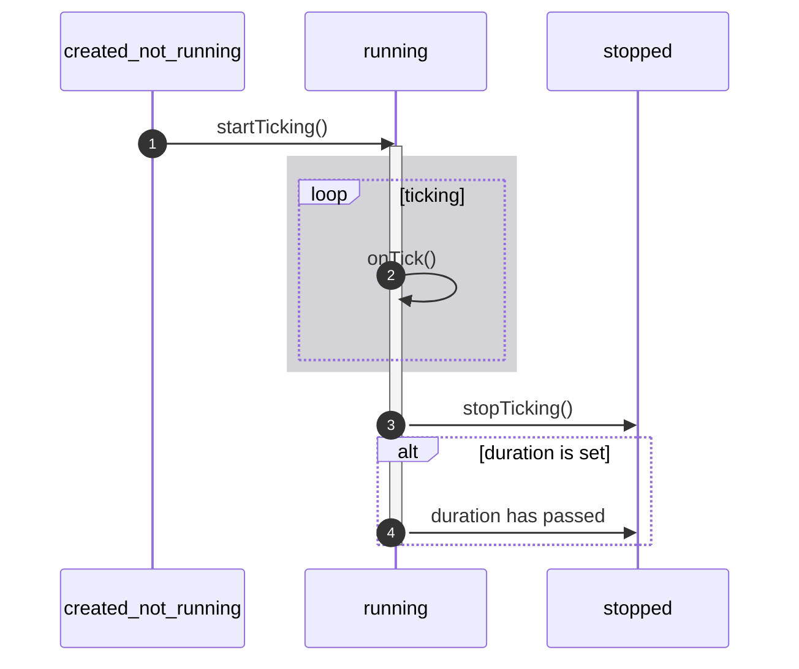

# r3bl-ts-utils npm package

The `r3bl-ts-utils` package is a set of useful TypeScript functions and classes that can be used in
Node.js and browser environments. They are inspired by Kotlin stdlib, and Rust to write code as
expressions rather than statements, colorized text, powerful Text User Interface (TUI) framework to
build powerful CLI apps, cache, and timer utilities.

The following groups of functionality are provided in this package.

1. [Scope functions](#scope-functions) inspired by [Kotlin stdlib scope functions][o-4] (`_also`,
   `_let`, `_apply`, `_with`, etc.). These allow you to write code that is more expression based
   rather than statement based.
2. [Misc language functions](#misc-language-functions), that allow you to write conditional code
   that is more expression based (like in Kotlin and Rust) rather than statement based (in
   JavaScript). Also provides some core classes that make it easy to work w/ data classes.
3. [Rust inspired language functions](#rust-language-functions), that allow you to avoid using
   `null` or `undefined` in your code. This is inspired by Rust's `Option` and `Result` types.
4. [Timer utilities](#timer-utils) that are easier and more robust to work w/ than `setInterval()`.
   These can be used to perform any recurring tasks that are on a fixed interval timer.
5. [Cache utilities](#cache-utils) that provide a cache that you can use that provides multiple
   eviction policies.
6. [Text User Interface (TUI) library](#text-user-interface-tui) is built on top of React and Ink
   and provides a comprehensive set of UI components, helper functions, types, and classes, and a
   full TUI application framework. You can use this to build very powerful feature rich TUI apps,
   which are command line interface apps that run in the terminal, that are keyboard driven, and
   have sophisticated layout and responsiveness support. This includes the following:
   1. [tui-colors](#colorized-text-tui-colors)
   2. [tui-figures](#fancy-unicode-characters-for-terminal-based-apps-tui-figures)
   3. [tui-color-console](#colorized-console-tui-color-console)
   4. [tui-node-keyboard](#keyboard-input-handling-for-nodejs-tui-node-keyboard)
   5. [tui-core](#core-react-hooks-types-functions-and-classes-tui-core)
   6. [tui-components](#text-user-interface-components-tui-components)

This module is written entirely in TypeScript, and is configured to be a CommonJS module.

> 💡 Here's more information on CommonJS, ESM, and hybrid modules.
>
> - [How to createCache dual modules][mod-1].
> - [Example of a dual module][mod-2].

<!-- prettier-ignore-start -->

[mod-1]: https://www.sensedeep.com/blog/posts/2021/how-to-create-single-source-npm-module.html

[mod-2]: https://github.com/sensedeep/dynamodb-onetable
<!-- prettier-ignore-end -->

To install the package, simply run the following in the top level folder of your project.

```shell
npm i r3bl-ts-utils
```

> For more information on how this package was created, or to facilitate a deep dive of the code
> written here, please read the [Node.js w/ TypeScript handbook][o-5] on developerlife.com.

Here are some important links for this package.

1. [Github repo][o-1]
2. [npm package][o-2]

<!-- prettier-ignore-start -->

[o-1]: https://github.com/r3bl-org/r3bl-ts-utils

[o-2]: https://www.npmjs.com/package/r3bl-ts-utils

[o-3]: https://github.com/nazmulidris/color-console

[o-4]: https://kotlinlang.org/docs/scope-functions.html

[o-5]: https://developerlife.com/2021/07/02/nodejs-typescript-handbook/
<!-- prettier-ignore-end -->

<!-- START doctoc generated TOC please keep comment here to allow auto update -->
<!-- DON'T EDIT THIS SECTION, INSTEAD RE-RUN doctoc TO UPDATE -->

- [Scope functions](#scope-functions)
  - [`_also`](#_also)
  - [`_alsoAsync`](#_alsoasync)
  - [`_alsoSafe`](#_alsosafe)
  - [`_alsoSafeAsync`](#_alsosafeasync)
  - [`_then`](#_then)
  - [`_let`](#_let)
  - [`_letSafe`](#_letsafe)
  - [`_apply`](#_apply)
  - [`_with`](#_with)
- [Misc language functions](#misc-language-functions)
  - [`Data` class and `anyToString()`](#data-class-and-anytostring)
  - [`_repeat()`](#_repeat)
  - [`_callIfTruthy()`](#_calliftruthy)
  - [`_callIfTruthyWithReturn()`](#_calliftruthywithreturn)
  - [`_callIfFalsy()`](#_calliffalsy)
  - [`_callIfTrue()`](#_calliftrue)
  - [`_callIfFalse()`](#_calliffalse)
  - [`_callIfTrueWithReturn()`](#_calliftruewithreturn)
- [Rust language functions](#rust-language-functions)
  - [`Option`, `Some`, `None`, `_callIfSome()`, and `_callIfNone()`](#option-some-none-_callifsome-and-_callifnone)
  - [`debug()`](#debug)
- [Timer utils](#timer-utils)
- [Cache utils](#cache-utils)
- [Text User Interface (TUI)](#text-user-interface-tui)
  - [Colorized text (tui-colors)](#colorized-text-tui-colors)
  - [Fancy Unicode characters for terminal based apps (tui-figures)](#fancy-unicode-characters-for-terminal-based-apps-tui-figures)
  - [Colorized console (tui-color-console)](#colorized-console-tui-color-console)
    - [Simple usage](#simple-usage)
    - [Advanced usage](#advanced-usage)
    - [`sleep()`](#sleep)
  - [Core (React) hooks, types, functions, and classes (tui-core)](#core-react-hooks-types-functions-and-classes-tui-core)
    - [`StateHook<T>`](#statehookt)
    - [`useForceUpdateFn()`](#useforceupdatefn)
    - [`_withRef()`](#_withref)
    - [`makeReactElementFromArray()`](#makereactelementfromarray)
    - [`useEventEmitter()`](#useeventemitter)
    - [`inkCLIAppMainFn()`](#inkcliappmainfn)
    - [`LifecycleHelper`](#lifecyclehelper)
    - [`useClock()`](#useclock)
    - [`useClockWithLocalTimeFormat()`](#useclockwithlocaltimeformat)
    - [`useTTYSize()`](#usettysize)
    - [`useStateSafely()`](#usestatesafely)
  - [Keyboard input handling for Node.js (tui-node-keyboard)](#keyboard-input-handling-for-nodejs-tui-node-keyboard)
    - [`useNodeKeypress()`](#usenodekeypress)
    - [`useKeyboard()`](#usekeyboard)
    - [`useKeyboardWithMap()`](#usekeyboardwithmap)
    - [`useKeyboardWithMapCached()`](#usekeyboardwithmapcached)
    - [`useKeyboardBuilder()`](#usekeyboardbuilder)
  - [Text User Interface components (tui-components)](#text-user-interface-components-tui-components)
    - [`ConfirmInput`](#confirminput)
    - [`MultiSelectInput`](#multiselectinput)
- [Build, test, and publish this package](#build-test-and-publish-this-package)
  - [Build, format, test](#build-format-test)
  - [Publish to npm](#publish-to-npm)
  - [Bump a package version (patch)](#bump-a-package-version-patch)
- [IDEA configuration](#idea-configuration)
- [VSCode settings](#vscode-settings)
- [References](#references)

<!-- END doctoc generated TOC please keep comment here to allow auto update -->

## Scope functions

The scope functions mimic Kotlin's `stdlib` scope functions (`also`, `let`, `apply`, `with`) one to
one. So here are four examples of using them. You can browse the source [here][sf-1].

> The [tests][sf-2] for this library are worth taking a look at to get a sense of how to use them.

<!-- prettier-ignore-start -->

[sf-1]: https://github.com/r3bl-org/r3bl-ts-utils/blob/main/src/kotlin-lang-utils.ts

[sf-2]: https://github.com/r3bl-org/r3bl-ts-utils/tree/main/src/__tests
<!-- prettier-ignore-end -->

### `_also`

[`_also()`][sf-1] takes a `contextObject`, passes it to the `ReceiverFn`, and returns the
`contextObject`. Here's an example.

```typescript
import { _also } from "r3bl-ts-utils"

const spans = _also(new Array<string>(3), (spans: string[]) => {
  spans[0] = "one"
  spans[1] = "two"
  spans[2] = "three"
})
const output = spans.join(", ")
console.log(output)
```

> You can name the argument to the `ReceiverFn` anything you like and not just `it` (which is the
> common practice in Kotlin).

### `_alsoAsync`

[`_alsoAsync()`][sf-1] is not part of Kotlin's `stdlib` scope functions, but it behaves similarly to
`_also()` except that it accepts an async receiver function (`ReceiverFnAsync`). And it returns the
`contextObject` and a promise from the async receiver function. Here's an example.

```tsx
import { _alsoAsync } from "r3bl-ts-utils"

const contextObject = "_alsoAsync"

let flag = false

// https://developer.mozilla.org/en-US/docs/Web/JavaScript/Reference/Statements/async_function
const asyncFn: ReceiverFnAsync<string, boolean> = async (it) =>
  new Promise<boolean>((resolveFn) => {
    const _fun = () => {
      expect(it).toEqual(contextObject)
      flag = true
      resolveFn(true)
    }
    // Delay execution of _fun to next iteration of event loop.
    // https://nodejs.dev/learn/understanding-setimmediate
    setImmediate(_fun)
  })

const { contextObject: obj, promiseFromReceiverFn: promise } = _alsoAsync(contextObject, asyncFn)

expect(obj).toEqual(contextObject)
expect(flag).toBeFalsy()

const value = await promise
expect(value).toBeTruthy()
expect(flag).toBeTruthy()
```

### `_alsoSafe`

[`_alsoSafe()`][sf-1] takes a `contextObject`, passes a deep copy of it to the `ReceiverFn`, and
returns this deep copy of `contextObject`. Here's an example.

```tsx
const contextObject = { foo: 1 }

let flag = false
const fun = (it: typeof contextObject): void => {
  expect(it).not.toBe(contextObject)
  flag = true
}

const returnValue = _alsoSafe(contextObject, fun)

expect(returnValue).not.toBe(contextObject)
expect(returnValue).toEqual(contextObject)
expect(flag).toBeTruthy()
```

### `_alsoSafeAsync`

[`_alsoSafeAsync()`][sf-1] is not part of Kotlin's `stdlib` scope functions, but it behaves
similarly to `_alsoAsync()` except that it accepts an async receiver function (`ReceiverFnAsync`).
And it returns a deep copy of then `contextObject` and a promise from the async receiver function.
Here's an example.

```tsx
const contextObject = { foo: 1 }

let flag = false

// https://developer.mozilla.org/en-US/docs/Web/JavaScript/Reference/Statements/async_function
const fun1: ReceiverFnAsync<typeof contextObject, boolean> = async (it) =>
  new Promise<boolean>((resolveFn) => {
    const _fun = () => {
      expect(it).toEqual(contextObject)
      expect(it).not.toBe(contextObject)
      flag = true
      resolveFn(true)
    }
    // Delay execution of _fun to next iteration of event loop.
    // https://nodejs.dev/learn/understanding-setimmediate
    setImmediate(_fun)
  })

const { contextObjectDeepCopy: obj, promiseFromReceiverFn: promise } = _alsoSafeAsync(
  contextObject,
  fun1
)

expect(obj).toEqual(contextObject)
expect(flag).toBeFalsy()

const value = await promise
expect(value).toBeTruthy()
expect(flag).toBeTruthy()
```

### `_then`

[`_then()`][sf-1] is not part of Kotlin's `stdlib` scope functions, but it behaves similarly to
`_also()`, except that it takes an array of receiver functions (each of which accepts a
`contextObject` argument), and runs them all sequentially. It returns `contextObject` just like
`_also()`. Here's an example.

```tsx
import { _then } from "r3bl-ts-utils"

const buffer = ""
const fun1: ReceiverFn<string> = (it) => (buffer += it)
const fun2: ReceiverFn<string> = (it) => (buffer += it)

const returnValue = _then("foo", fun1, fun2)
expect(returnValue).toEqual(contextObject)
expect(buffer).toEqual("foofoo")
```

### `_let`

[`_let()`][sf-1] takes a `contextObject`, passes it to the `ReceiverFnWithReturn`, and returns its
return value. Here's an example.

```typescript
import { _let } from "r3bl-ts-utils"

const contextObject = "string"
const returnValue = _let(contextObject, (it) => {
  return `my-${it}`
})
expect(returnValue).toEqual(`my-string`)
```

> The call to `_let(...)` returns the value of the 2nd argument `ReceiverFnWithReturn` and not the
> first argument `contextObject`.

### `_letSafe`

[`_letSafe()`][sf-1] takes a `contextObject`, and passes a deep copy of it to the
`ReceiverFnWithReturn`, and returns its return value. Here's an example.

```tsx
const contextObject = { foo: 1 }
const receiverFnReturnValue = Symbol()

// https://jasmine.github.io/2.1/introduction#section-Spies:_%3Ccode%3Eand.callThrough%3C/code%3E
const myReceiverFn: ReceiverFnWithReturn<typeof contextObject, symbol> = (it) => {
  expect(it).toEqual(contextObject)
  expect(it).not.toBe(contextObject)
  return receiverFnReturnValue
}
const spyObjectContainingFn = { myReceiverFn }
spyOn(spyObjectContainingFn, "myReceiverFn").and.callThrough()

const returnValue = _letSafe(contextObject, spyObjectContainingFn.myReceiverFn)
expect(returnValue).toEqual(receiverFnReturnValue)
expect(spyObjectContainingFn.myReceiverFn).toHaveBeenCalled()
```

### `_apply`

[`_apply()`][sf-1] takes a `contextObject`, binds it to `ImplicitReceiverObject`'s `this`, calls it,
then returns the `contextObject`. Here's an example.

```typescript
import { _apply, ImplicitReceiverObject } from "r3bl-ts-utils"

const contextObject: string = "string"
const myImplicitReceiverObject: ImplicitReceiverObject<string> = {
  fnWithReboundThis: function (): string {
    expect(this).toEqual(contextObject)
    return contextObject
  },
}
const returnValue = _apply(contextObject, myImplicitReceiverObject)
expect(returnValue).toEqual(contextObject)
```

> In the code above, you can just inline the `myImplicitReceiverObject` into the line where you call
> `_apply()`. The code is written in this verbose way just for clarity.
>
> ⚠ Please note that the `fnWithReboundThis` can't be an arrow function, since it would not allow
> `this` to be rebound.

### `_with`

[`_with()`][sf-1] takes a `contextObject`, binds it to `ImplicitReceiverObjectWithReturn`'s `this`,
calls it then returns the its return value. Here's an example.

```typescript
import { _with, ImplicitReceiverObjectWithReturn } from "r3bl-ts-utils"

const contextObject: string = "some_data"
const hardcodedReceiverReturnValue: Symbol = Symbol()
const returnValue = _with(contextObject, {
  fnWithReboundThis: function (): symbol {
    expect(this).toEqual(contextObject)
    return hardcodedReceiverReturnValue
  },
})
expect(returnValue).toEqual(hardcodedReceiverReturnValue)
```

> In the code above, you can just inline the `myImplicitReceiverObjectWithReturn` into the line
> where you call `_with()`. The code is show in this verbose way just for clarity.
>
> ⚠ Please note that the `fnWithReboundThis` can't be an arrow function, since it would not allow
> `this` to be rebound.

## Misc language functions

### `Data` class and `anyToString()`

Inspired by Kotlin's data classes, the `Data` class is provided which makes it really easy to get a
`toString()` implementation that pretty formats the string for free. It makes use of the
`anyToString()` function that you can choose to use instead of using the class. Here's an example.

```tsx
class MapData extends Data {
  constructor(
    readonly name: string = "MapData contains properties: string, string, Map, Array",
    readonly type: string = "string",
    readonly map: Map<any, any> = new Map().set("foo", "1").set("bar", "2"),
    readonly array: Array<string> = ["one", "two", "three"]
  ) {
    super()
  }
}

console.log(new MapData().toString())
```

### `_repeat()`

This is loosely inspired by the Kotlin scope function style and the `repeat` function in JavaScript.
You can pass a lambda and have it repeat `n` times. Here's an example.

```tsx
let count = 0
_repeat(5, () => count++)
expect(count).toEqual(5)
```

### `_callIfTruthy()`

This is inspired from the style of Kotlin scope functions [above](#scope-functions). If the
`contextObject` is [truthy](https://developer.mozilla.org/en-US/docs/Glossary/Truthy), then the
lambda is executed & it gets the type-safe non-null reference to `contextObject`. Here's an example.

```tsx
type CtxObjType = { foo: number }
const contextObject: CtxObjType | undefined = { foo: 1 }

let executed = false
const returnValue = _callIfTruthy(contextObject, (it: CtxObjType) => {
  expect(it).toBeDefined()
  expect(it).toEqual({ foo: 1 })
  executed = true
})
expect(returnValue).toBeTruthy()
expect(returnValue).toBe(contextObject)
expect(executed).toBeTruthy()
```

### `_callIfTruthyWithReturn()`

This is similar to `_callIfTruthy` except that it will return the return value of the lambda that's
passed.

This is an interesting control flow expression. It is another way to represent an `if statement`.
Three arguments need to be passed.

1. The first is the condition variable which can evaluate to truthy or falsy.
2. The 2nd is the lambda that is executed if the condition holds true. The return value of this
   lamba is returned by the expression.
3. The 3rd argument is the lambda that's executed if the condition holds false. The return value of
   this lambda is returned by the expression.

```tsx
// Condition is truthy.
_also(
  {
    onTrueFlag: false,
    onFalseFlag: false,
  },
  (flags) => {
    const returnValue = _callIfTruthyWithReturn(
      "foo",
      (it) => {
        expect(it).toEqual("foo")
        flags.onTrueFlag = true
        return "true"
      },
      () => {
        flags.onFalseFlag = false
        return "false"
      }
    )
    expect(returnValue).toEqual("true")
    expect(flags.onTrueFlag).toBeTruthy()
    expect(flags.onFalseFlag).toBeFalsy()
  }
)

// Condition is falsy.
_also(
  {
    onTrueFlag: false,
    onFalseFlag: false,
  },
  (flags) => {
    const returnValue = _callIfTruthyWithReturn(
      undefined,
      (it) => {
        expect(it).toBeFalsy()
        flags.onTrueFlag = false
        return "true"
      },
      () => {
        flags.onFalseFlag = true
        return "false"
      }
    )
    expect(returnValue).toEqual("false")
    expect(flags.onTrueFlag).toBeFalsy()
    expect(flags.onFalseFlag).toBeTruthy()
  }
)
```

### `_callIfFalsy()`

This is the inverse of `_callIfTruthy`. If the `contextObject` is
[falsy](https://developer.mozilla.org/en-US/docs/Glossary/Falsy), then the lambda is executed & it
gets the type-safe non-null reference to `contextObject`. Here's an example.

```tsx
let executedIfNull = false
let executedIfUndefined = false

_callIfFalsy(undefined, () => {
  executedIfUndefined = true
})
_callIfFalsy(null, () => {
  executedIfNull = true
})

expect(executedIfUndefined).toBeTruthy()
expect(executedIfNull).toBeTruthy()
```

### `_callIfTrue()`

This is similar to `_callIfTruthy` except that the first argument is a `boolean`. Here's an example.

```tsx
let flag = false
const fun = () => {
  flag = true
}
_callIfTrue(false, fun)
expect(flag).toBeFalsy()
_callIfTrue(true, fun)
expect(flag).toBeTruthy()
```

### `_callIfFalse()`

This is the inverse of `_callIfFalse`. Here's an example.

```tsx
let flag = true
const fun = () => {
  flag = false
}
_callIfFalse(true, fun)
expect(flag).toBeTruthy()
_callIfFalse(false, fun)
expect(flag).toBeFalsy()
```

### `_callIfTrueWithReturn()`

This is similar to `_callIfTruthyWithReturn` except that it accepts a boolean condition expression.

This is an interesting control flow expression. It is another way to represent an `if statement`.
Three arguments need to be passed.

1. The first is the condition variable which can evaluate to true or false.
2. The 2nd is the lambda that is executed if the condition holds true. The return value of this
   lamba is returned by the expression.
3. The 3rd argument is the lambda that's executed if the condition holds false. The return value of
   this lambda is returned by the expression.

Here's an example.

```tsx
// Condition is true.
_also(
  {
    onTrueFlag: false,
    onFalseFlag: false,
  },
  (flags) => {
    const returnValue = _callIfTrueWithReturn(
      true,
      () => {
        flags.onTrueFlag = true
        return "true"
      },
      () => {
        flags.onFalseFlag = false
        return "false"
      }
    )
    expect(returnValue).toEqual("true")
    expect(flags.onTrueFlag).toBeTruthy()
    expect(flags.onFalseFlag).toBeFalsy()
  }
)

// Condition is false.
_also(
  {
    onTrueFlag: false,
    onFalseFlag: false,
  },
  (flags) => {
    const returnValue = _callIfTrueWithReturn(
      false,
      () => {
        flags.onTrueFlag = false
        return "true"
      },
      () => {
        flags.onFalseFlag = true
        return "false"
      }
    )
    expect(returnValue).toEqual("false")
    expect(flags.onTrueFlag).toBeFalsy()
    expect(flags.onFalseFlag).toBeTruthy()
  }
)
```

## Rust language functions

### `Option`, `Some`, `None`, `_callIfSome()`, and `_callIfNone()`

Avoid using `null` or `undefined` in your code by using `Option` and `None` and `Some`. This is
similar to what you get in Rust. However, it is implemented using TypeScript discriminated unions
and an abstract class. A lot of the code in this library itself has been rewritten using this
pattern to avoid `null` or `undefined` resulting in much easier to reason about code.

Here's an example.

```tsx
import { KeypressOption, _callIfSome } from "r3bl-ts-utils"

const onKeypress = (keypress: KeypressOption) => {
  _callIfSome(keypress, (keypress) => {
    if (keypress.matches("return")) returnPressed()
    if (keypress.matches("downarrow")) downarrowPressed()
    if (keypress.matches("uparrow")) uparrowPressed()
    if (keypress.matches("space")) spacePressed()
    if (keypress.matches("delete")) deletePressed()
    if (keypress.matches("backspace")) deletePressed()
  })
}
```

Here's an example of using a `None` value in a `useStateSafely` hook.

```tsx
import { useStateSafely, Option } from "r3bl-ts-utils"

type KeypressOption = Option<Readonly<Keypress>>
const [keypress, setKeypress] = useStateSafely<KeypressOption>(Option.none()).asArray()
```

Here's an eample of using a `Some` value in a `useStateSafely` hook.

```tsx
import { Optional, TimerTickFn, Option } from "r3bl-ts-utils"

let _onStartFn: Option<TimerTickFn> = Option.none()
function setOnStartFn(value: Optional<TimerTickFn>) {
  _onStartFn = Option.create(value) // same as Option.some(value)
}
```

You can check to see whether an `Option` value is `Some` or `None` by using the `isSome` and
`isNone` functions. These functions also act as user defined type guards
([via type predicate](https://www.typescriptlang.org/docs/handbook/2/narrowing.html#using-type-predicates))
and will narrow the type of the `Option` to `None` / `Some` when used in an `if` statement. Here's
an example.

```tsx
{
  keyPress.isSome() ? (
    <Text color="cyan">{keyPress.value.toString()}</Text>
  ) : (
    <Text color="red">!keyPress</Text>
  )
}
```

### `debug()`

This function is simply based on the `debug!` macro in the Rust standard library. It is used to
pretty print the argument passed to it, along w/ a message. The argument passed is simply returned
by the function. Here's an example.

```tsx
import { debug } from "r3bl-ts-utils"

const value = "some_value"
expect(debug("message", value)).toBe("some_value")
```

## Timer utils


<!--

-->

To use the timer utils, use the factory function `createTimer()` which returns an object that
implements the `Timer` interface. This interface and the [tests][sf-2] are a great place to discover
the API surface. Here's an example of using this in a React function component that uses Hooks to
generate a CLI interface using [ink](https://github.com/vadimdemedes/ink).

```tsx
import React, { FC } from "react"
import { Timer, createTimer } from "r3bl-ts-utils"
import { _also } from "r3bl-ts-utils"
import { _withRef, StateHook, useForceUpdateFn } from "r3bl-ts-utils"
import { Text } from "ink"

export const ComponentUsingTimer: FC = () => {
  const myTimerRef: ReactRef<Timer> = React.useRef<Timer>()

  /* ⚡ From React Hook utils. */
  const [count, setCount]: StateHook<number> = React.useState<number>(0)
  const forceUpdateFn = useForceUpdateFn()

  React.useEffect(effectToStartTimer, [] /* componentDidMount */)
  React.useEffect(effectToCheckStoppingTimer)

  return render()

  // Define the functions used above.

  function effectToStartTimer() {
    /* ⚡ From scope functions. */
    const timer = _also(createTimer(TimerConfig.name, TimerConfig.updateIntervalMs), (it) => {
      myTimerRef.current = it
      it.onTick = tickFn
    }).startTicking()

    return () => {
      if (timer.isStarted) timer.stopTicking()
      DEBUG && console.log(`😵 unmount`, myTimerRef.current)
    }
  }

  function tickFn(timer: Timer): void {
    setCount(timer.counter.value)
    DEBUG && console.log(`"${timer.name}"`, timer.isStarted, timer.counter.value)
  }

  function effectToCheckStoppingTimer() {
    _withRef(myTimerRef, (timer) => {
      if (timer.isStarted) {
        if (timer.counter.value >= TimerConfig.maxCounter) {
          timer.stopTicking()
          forceUpdateFn() // Force a re-render after timer has stopped, to show the skull.
        }
      }
    })
  }

  function render() {
    return (
      <Text color={"green"}>
        [{count} tests passed]
        {showSkullIfTimerIsStopped()}
      </Text>
    )
  }

  function showSkullIfTimerIsStopped() {
    return !myTimerRef.current?.isStarted ? "💀" : null
  }
}

const TimerConfig = {
  name: "Count to 5 timer",
  updateIntervalMs: 1000,
  maxCounter: 5,
}
```

## Cache utils

Cache utils provides an object that implements the `Cache` interface, that is created by the
`createCache()` factory function. You can specify the max size of the cache, and even declare which
eviction policy it should use. You can also provide a function that generates a value for a given
key if it doesn't exist in the cache. Here's an example of how to use this class.

```tsx
import { createCache, _repeat } from "r3bl-ts-utils"

test("Cache eviction policy least-recently-used works", () => {
  let populateFn = (arg: string): string => arg + "_test"
  const cache = createCache<string, string>("test", 2, "least-recently-used")

  cache.get("foo", populateFn)
  cache.get("bar", populateFn)
  cache.get("baz", populateFn)

  expect(cache.size).toEqual(2)
  expect(cache.contains("foo")).toBeFalsy()
  expect(cache.contains("bar")).toBeTruthy()
  expect(cache.contains("baz")).toBeTruthy()
})

test("Cache eviction policy least-frequently-used works", () => {
  let populateFn = (arg: string): string => arg + "_test"
  const cache = createCache<string, string>("test", 2, "least-frequently-used")

  _repeat(3, () => cache.get("foo", populateFn))
  _repeat(2, () => cache.get("bar", populateFn))
  cache.get("baz", populateFn)

  expect(cache.size).toEqual(2)
  expect(cache.contains("foo")).toBeTruthy()
  expect(cache.contains("bar")).toBeTruthy()
  expect(cache.contains("baz")).toBeFalsy()
})
```

An async version of `ComputeValueForKeyFn` is also provided, aptly named
`ComputeValueForKeyAsyncFn`. Here's an example of how to use this async form.

```tsx
import { createCache } from "r3bl-ts-utils"

test("can getAndComputeIfAbsentAsync from Cache", async () => {
  let executionCount = 0
  const populateAsyncFn = (arg: string): Promise<string> => {
    return new Promise((resolve) => {
      setTimeout(() => {
        resolve(arg + "_test")
        executionCount++
      }, 10)
    })
  }
  const cache = createCache<string, string>("test", 2, "least-frequently-used")

  // Cache miss for "foo" -> insert.
  await expect(cache.getAndComputeIfAbsentAsync("foo", populateAsyncFn)).resolves.toEqual(
    "foo_test"
  )

  // Cache hit for "foo".
  expect(cache.contains("foo")).toBeTruthy()
  await expect(cache.getAndComputeIfAbsentAsync("foo", populateAsyncFn)).resolves.toEqual(
    "foo_test"
  )
  expect(executionCount).toBe(1)
})
```

## Text User Interface (TUI)

### Colorized text (tui-colors)

The `TextColor` class provides a DSL (domain specific language) that makes it trivial to generate
reusable styles to apply ANSI colors to strings. This is very useful when making CLI (command line
interface) apps or colorful console log outputs. For just color colorful console output, you can
check out the next section on [Colorized console](#colorized-console). You can browse the source
[here][cc-1].

> This serves as TypeScript replacements of both `colors.js` and `chalk` libraries (both of which
> are written in JavaScript).

Here is a simple example that colorizes a string.

```tsx
import { TextColor } from "r3bl-ts-utils"

const expected: string = "text"
const style = TextColor.builder.red.bgWhite.build()
expect(style("text")).toEqual(expected)
expect(style.applyFormatting("text")).toEqual(expected)
```

Here's similar functionality via a one liner.

```tsx
import { TextColor } from "r3bl-ts-utils"

const formattedOutput = TextColor.builder.red.bgWhite.build()("text")
const expected: string = "text"
expect(formattedOutput).toEqual(expected)
```

### Fancy Unicode characters for terminal based apps (tui-figures)

The `figures` object provides a set of Unicode symbols that can be used to pretty print console /
terminal based output. Things like checkboxes, circles, arrows, etc. are provided for convenience.
And it doesn't rely on using emoji.

> This serves as a TypeScript replacement of `figures` library (which is written in JavaScript).

### Colorized console (tui-color-console)

Let's look at how to use this by example. You can browse the source [here][cc-1].

#### Simple usage

You can simply colorize existing `console.log` and `console.error`, like this using the default
styles that are provided in `Styles`.

```typescript
import { printHeader, Styles } from "r3bl-ts-utils"

printHeader(`Example 1`)

console.log(Styles.Primary(`Wrote file successfully. 👍`))
console.error(Styles.Secondary(`Failed to write file! ⛔`))

Styles.Primary(`Wrote file successfully. 👍`).consoleLog()
Styles.Secondary(`Failed to write file! ⛔`).consoleError()
```

To override on the default styles, here's an example.

<!-- prettier-ignore-start -->

[cc-1]: https://github.com/r3bl-org/r3bl-ts-utils/blob/main/src/
<!-- prettier-ignore-end -->

#### Advanced usage

Here's how you can use the `ColorConsole` class to do more powerful things.

```typescript
import { printHeader, Styles, ColorConsole } from "r3bl-ts-utils"

printHeader(`Example 2`)
const myColorConsole = ColorConsole.create((text) => colors.bold(colors.yellow(text)))
myColorConsole(/* text: */ `Start log output...`).consoleLog()

const count = 4
while (count-- > 0) {
  ColorConsole.create(Styles.Primary)(`While loop output: ${count}`).consoleLogInPlace()
}

ColorConsole.create(Styles.Secondary)(/* text: */ `End log output...`).consoleLog(
  /* prefixWithNewLine: */ true
)
```

> Note that once created, using `create()`, you can simply call that instance w/out passing a
> method. This happens because the `create()` factory method creates a new `ColorConsole` object,
> which also implements the `ColorConsoleIF` interface, which is callable) by providing a
> `(text: string)` signature that binds to the `call(text: string)` method.

If you don't deviate from the `Primary` and `Secondary` styles, then you can simply use some default
`ColorConsole` instances that have been created for you like this.

```typescript
import { printHeader, Styles, ColorConsole, StyledColorConsole } from "r3bl-ts-utils"
import * as _ from "lodash"

printHeader(`Example 3`)
const data = { foo: "foo_value", bar: "bar_value" }
for (const key in data) {
  StyledColorConsole.Primary(
    Styles.Primary(key) + " -> " + Styles.Secondary(_.get(data, key))
  ).consoleLog()
}
```

#### `sleep()`

This function simply puts the current async function to sleep and prints a spinner in console
stdout. Here's an example of it in action (in a Node.js program).

```typescript
import { printHeader, sleep } from "r3bl-ts-utils"

const main = async (): Promise<void> => {
  printHeader(`Example 1 - spawn a child process to execute a command`)
  await new SpawnCProcToRunLinuxCommandAndGetOutput().run()
  await sleep(1000)

  printHeader(`Example 2 - pipe process.stdin into child process command`)
  await new SpawnCProcAndPipeStdinToLinuxCommand().run()
  await sleep(1000)

  printHeader(`Example 3 - pipe the output of one child process command into another one`)
  await new SpawnCProcToPipeOutputOfOneLinuxCommandIntoAnother().run()
  await sleep(1000)

  printHeader(`Example 4 - replace the functionality of a fish shell script`)
  await new SpawnCProcToReplaceFunctionalityOfFishScript().run()
  await sleep(1000)
}

main().catch(console.error)
```

### Core (React) hooks, types, functions, and classes (tui-core)

The following utility functions make it easier to work w/ React in general.

#### `StateHook<T>`

The following [utility types](https://www.typescriptlang.org/docs/handbook/utility-types.html) and
custom hooks make it easier to work w/ React function components and hooks.

The `StateHook<T>` utility type makes it easy to describe the array returned by
`React.useState<T>()`. Here's an example.

```tsx
import { StateHook } from "r3bl-ts-utils"

export const MyFunctionalComponent: FC = () => {
  const [count, setCount]: StateHook<number> = React.useState<number>(0)
  /* snip */
}
```

#### `useForceUpdateFn()`

The `useForceUpdateFn()` is a custom hook that makes it easy for you to force a re-render of your
component (when there are no props or state changes to trigger them). Here's an example.

```tsx
import { useForceUpdateFn } from "r3bl-ts-utils"

export const MyFunctionalComponent: FC = () => {
  const forceUpdateFn = useForceUpdateFn()
  React.useEffect(() => setTimeout(forceUpdateFn, 1000), [] /* componentDidMount. */)
  return <h1>{Date.now()}</h1>
}
```

#### `_withRef()`

The `_withRef()` function provides a slightly cleaner syntax to working w/
[`React.useRef().current`](https://developerlife.com/2021/10/19/react-hooks-redux-typescript-handbook/#first-render-and-subsequent-re-renders-using-useref-and-useeffect)
.

The `current` property can be [nullish](https://developer.mozilla.org/en-US/docs/Glossary/Nullish)
and while you can use
[optional chaining](https://developer.mozilla.org/en-US/docs/Web/JavaScript/Reference/Operators/Optional_chaining)
to access this property's value, it can be quite clunky to write this code. Here's a snippet.

```tsx
const myTimerRef: ReactRef<Timer> = React.useRef<Timer>()

function showSkullIfTimerIsStopped() {
  return !myTimerRef.current?.isStarted ? "💀" : null
}
```

When using `_withRef()` you have to think about 2 arguments, the ref itself, and a lambda that you
want to execute that does something w/ the `current` property of the ref, if its
[truthy](https://developer.mozilla.org/en-US/docs/Glossary/Truthy).

The following code snippet is an example of a lambda that operates on the `current` property of the
`myTimerRef`, which holds a `Timer` object.

```tsx
import { ReactRefReceiverFn, ReactRef, _withRef, useForceUpdateFn } from "r3bl-ts-utils"
import * as React from "react"

const myTimerRef: ReactRef<Timer> = React.useRef<Timer>()

function MyComponent() {
  React.useEffect(() => _withRef(myTimerRef, checkIfTimerIsStopped))
  return <h1>{!myTimerRef.current?.isStarted ? "✋" : "🏃"}</h1>
}

const checkIfTimerIsStopped: ReactRefReceiverFn<Timer> = (timer: Timer) => {
  if (timer.isStarted) {
    if (timer.counter.value >= TimerConfig.maxCounter) {
      timer.stop()
      forceUpdateFn() // Force a re-render after timer has stopped, to show the skull.
    }
  }
}
```

> 💡 Note that the `ReactRef<T>` utility type is also provided to make it easy to work w/ objects
> returned by `React.useRef<T>()`. Additionally, `ReactRefReceiverFn<T>` is provided to make it easy
> to type the function lambda that is passed as a 2nd argument to `_withRef()`.

#### `makeReactElementFromArray()`

A common pattern in composing React elements is taking an array and converting into a list of JSX
elements. This also requires that a key be inserted in each of the rendered items. This is code that
has to written repeatedly and this function aims to eliminate the need for that. Here's an example.

```tsx
import { emptyArray, makeReactElementFromArray, RenderEachInputFn } from "r3bl-ts-utils"
import { Text } from "ink"
import React, { FC } from "react"

const Row_Instructions: FC = function (): JSX.Element {
  const inputs = [
    ["blue", "Press Tab to focus next element"],
    ["blue", "Shift+Tab to focus previous element"],
    ["blue", "Esc to reset focus."],
    ["red", "Press q to exit"],
  ]

  return makeReactElementFromArray(inputs, renderToText)

  function renderToText(line: string[], id: number): JSX.Element {
    return (
      <Text color={line[0]} key={id}>
        {line[1]}
      </Text>
    )
  }
}
```

#### `useEventEmitter()`

When building user interfaces (UIs) for command line interface (CLI) apps it becomes necessary to
incorporate external (to React) async events that are generated by some event emitter (for eg, a
keypress event or some other async event that comes in from a `process` or `fs` object). To bring
these events into the React code, we would think to just use a `useEffect()` hook somehow to do
this, but unfortunately it isn't that simple.

When writing custom hooks, that relay external async events (eg, happening in a listener that is
attached Node.js, or a database, etc.), it is important to keep in mind that callback functions that
are passed to `useEffect()` **can not directly call** into the React function component 🧨!

> 🤔 This is a very subtle but important point to remember when figuring how to "relay" the
> non-React async event into the React function component world (via a custom hook that you're
> writing). When using "normal" React (host components in a browser) we don't get to see this
> because the code that interfaces with the browser's DOM is provided to us. So we are used to
> attaching a callback function to an
> [`onclick` props of a `button` in React](https://reactjs.org/docs/handling-events.html), and it
> would just work 🧙. However, under the covers this host component is taking care of interfacing w/
> a DOM async event emitter to invoke callback function via
> [`addEventListener`](https://dom.spec.whatwg.org/#dom-eventtarget-addeventlistener) and doing
> something similar to this hook.

It might be tempting to simply pass a React-function-component-callback function to a hook, which
then passes it on to an external event emitter listener 😈. When the listener is then executed by
the external event emitter (which is not a React function component) then problems will arise! The
state information that this React-function-component-callback will get will be wrong.

The way to get around this issue is to do the following:

1. Introduce an intermediate state variable (via `useState()` hook).
2. Have your external event listener use the setter for this state variable to let your hook know
   that some external event just came in.
3. Use `useEffect()` and pass the getter for this state variable as a dependency to a function that
   gets called when this state variable changes. This function will be able to then run the
   React-function-component-callback that is passed into the hook to begin with.

> 💡 Please read about this in much more detail in this
> [developerlife.com article on hooks](https://developerlife.com/2021/10/19/react-hooks-redux-typescript-handbook/#custom-hooks).

Instead of doing all of these steps manually, you can just use `useEventEmitter()` hook! 🎉 Here's
an example.

```tsx
import { useEventEmitter } from "r3bl-ts-utils"

const emitter = new EventEmitter()
const eventName = "my-event-name"

const onEventName: HandleNodeKeypressFn = (input: string, key: ReadlineKey) =>
  _let(createFromKeypress(key, input), (keyPress) => {
    // Using keypress, determine which function to call inside React UI. Or maybe dispatch a Redux
    // action.
  })
useEventEmitter(emitter, eventName, onEventName, { isActive: true })
```

#### `inkCLIAppMainFn()`

This launches a CLI app. This is the "bootloader" equivalent for a CLI app.

> 💡 If you have any event listeners attached (eg, using `useKeyboard()`, or `useNodeKeypress()`)
> then your app won't exit if you don't call `LifecycleHelper.fireExit()`.

Usage example:

```tsx
const App: FC = () => {
  const createShortcutsFn = (): ShortcutToActionMap =>
    _also(createNewShortcutToActionMap(), (map) => map.set("q", LifecycleHelper.fireExit))
  useKeyboardWithMapCached(createShortcutsFn)
  return <Text>"Hello"</Text>
}

inkCLIAppMainFn(() => {
  const args = processCommandLineArgs()
  return createInkApp(args)
}).catch(console.error)
```

#### `LifecycleHelper`

This utility class is intended to be used in command line interface apps that run in a terminal (in
Node.js). However, it can be used in browsers as well. The idea w/ this class is to fire a global
`start` event when the CLI app container has started and is warm. And to fire a `exit` event when
the container is in the process of initiating its exit (before `process.exit()` is called). Your
code can attach listeners to these events. And you have to wire this class into the key lifecycle
events of your app. Here's an example.

```tsx
//#region main().
type MainParams = "node-keypress" | "ink-compat"
export const main = (arg: MainParams) => {
  const instance = render(<App arg={arg} />)
  LifecycleHelper.addExitListener(() => {
    instance
      .waitUntilExit()
      .then(() => {
        console.log("Exiting ink")
      })
      .catch(() => {
        console.error("Problem with exiting ink")
      })
    TimerRegistry.killAll()
    instance.unmount()
  })
}
//#endregion
```

#### `useClock()`

The `useClock()` custom hook can be used start a clock that ticks every 1 second and updates the
state. The hook returns a `number` that can be used to render a UI in React.

Here's an example.

```tsx
/** App function component. */
export const appFn: FC<{ name: string }> = ({ name }) => render(runHooks(name))

function runHooks(name: string): LocalVars {
  const time = useClock()
  return {
    time,
  }
}

interface LocalVars {
  time: number
}

function render(locals: LocalVars) {
  const { time } = locals
  return <Text>{new Date(time).toLocaleTimeString()}</Text>
}
```

The hook does clean up after itself (it will kill its internal `Timer` when it's enclosing component
is unmounted). You can also call `TimerRegistry.killAll()` when you exit your app to make sure.
Here's an example of doing this for a command line interface app built using Ink.

```tsx
_also(render(createElement(appFn, { name: !name ? "Stranger" : name })), (ink) => {
  ink
    .waitUntilExit()
    .then(() => {
      TimerRegistry.killAll()
    })
    .catch(() => {
      console.error("Problem with exiting ink")
    })
})
```

#### `useClockWithLocalTimeFormat()`

This is very similar to `useClock()` except that it takes a `delayMs` argument that sets the delay
that is used to tick the clock. It returns an object that contains both the locale formatted time
string and the time in ms.

#### `useTTYSize()`

The `useTTYSize()` custom hook can be used to determine what the width and height of a TTY is, in
CLI apps that use Ink. It uses Node.js stdout stream to get this information.

Here's an example. When you resize the terminal window, it will re-render the component and display
the current terminal size.

```tsx
import React from "react"
import { render, Text } from "ink"
import { useTTYSize, TTYSize } from "r3bl-ts-utils"

function Application() {
  const size: TTYSize = useTTYSize()
  return (
    <Text>
      {size.rows}×{size.columns}
    </Text>
  )
}

const { unmount } = render(<Application />)

setTimeout(() => unmount(), 30_000)
```

#### `useStateSafely()`

The `useStateSafely()` custom hook behaves like the "normal" `useState()` hook with the differences
being that difference it won't update the state if its enclosing component has been unmounted. It
also returns an object if you want (or an array if you like). This is useful in CLI (command line
interface) apps where a component could be unmounted (eg, via a keyboard shortcut to switch to a
different tab or even exit the app). Here's an example of how to use it.

```tsx
import { _let } from "r3bl-ts-utils"

const UseTextInput: FC = () => _let(useStateSafely(""), createComponent)
// To get an array, call `useStateSafely("").toArray()`.

const createComponent = ({ value: query, setValue: setQuery }): ReactElement => (
  <Box flexDirection="column">
    <Box flexDirection="row" marginRight={1}>
      <Text>Enter your query: </Text>
      <TextInput value={query} onChange={setQuery} />
    </Box>
    <Text>You typed: {TextColor.builder.rainbow.build()(query)}</Text>
  </Box>
)
```

### Keyboard input handling for Node.js (tui-node-keyboard)

#### `useNodeKeypress()`

This hook is an alternative to the `useInput()` hook from `ink`. Both are meant to capture key
presses from a terminal. It uses Node.js readline package which emits `keypress` events which are
different from the `data` events that `useInput()` relies on. This means that a few more key events
are available using this approach which is useful for command line interface (CLI) apps that rely on
keyboard shortcuts for doing most things. However, the limitations on what key events a TTY can even
get in Node.js is limited by Node.js itself. For this reason we hope to provide our own native Rust
based keypress input event handling plugin for Node.js in the future
([here's the issue](https://github.com/r3bl-org/r3bl-cmdr/issues/1)).

There is one side effect that happens when this hook in addition to `useInput()`, which comes from
how one actually uses `keypress` events and the other uses `data` events, which is that they both
manage the raw mode of the TTY stdin stream (from Node.js). And this can lead to CLI apps quitting
unexpectedly and issues w/ keyboard focus management. In order to solve this, there are 2
approaches:

1. You can use ink compat versions of all the hooks in this section and bypass `useNodeKeypress()`
   all together.
2. You can wrap your main app w/ a `Provider` that configures Ink correctly and lets it know that
   `useNodeKeypress()` will be managing raw mode for the terminal. The easiest way to do this is to
   wrap your entire application w/ `UseKeyboardWrapper` component.

> ⚡ For a full example, please check out
> [/src/experimental/confirm-input/node-keypress.tsx][node-keypress-src].

<!-- prettier-ignore-start -->

[node-keypress-src]: https://github.com/r3bl-org/r3bl-ts-utils/blob/e030062271135fae049c63af1dc11bd21a8c1833/src/experimental/confirm-input/node-keypress.tsx
<!-- prettier-ignore-end -->

> #### Implementation details
>
> 💡 Ink has a hook that is supposed to be used to get user input from the keyboard called
> `useInput`, which comes from the `ink` package. `TextInput` is built on top of this hook.
> `TextInput` comes from the npm package `ink-text-input`.
>
> 1. [Source code for useInput sets raw mode to false](https://github.com/vadimdemedes/ink/blob/master/src/hooks/use-input.ts#L126)
> 2. [Source code for TextInput uses useInput](https://github.com/vadimdemedes/ink-text-input/blob/master/source/index.tsx#L117)
>
> The `useKeyboard` hook does not use `useInput` from Ink. It does the following things.
>
> 1. It will set raw mode to true when used.
> 2. It will turn raw mode to false when unmounted.
> 3. It uses Node.js readline keypress events to better detect key presses (instead of `useInput`).
>
> The problem w/ `TextInput` using `useInput` and then turning raw mode to off when focus changes on
> `TextInput` simply causes the Node.js process to exit, since there are no active listeners
> attached to it 🤯.
>
> 🤔 To mitigate this problem one approach could to be call `useInput(noop)` somewhere in the
> component that includes `TextInput`.
>
> 🤔 However, this does not get rid of the default "ctrl+c" handling, which is to exit the app (this
> is how `useInput` behaves by default). You can override it by wrapping your Ink components in a
> Provider, like so:
>
> ```tsx
> <StdinContext.Provider
>   value={{
>     stdin: process.stdin,
>     setRawMode: noop,
>     isRawModeSupported: true,
>     internal_exitOnCtrlC: false,
>   }}
> >
>   <App />
> </StdinContext.Provider>
> ```
>
> 🧙 or simply:
>
> ```tsx
> <UseKeyboardWrapper>
>   <App />
> </UseKeyboardWrapper>
> ```

#### `useKeyboard()`

The `useKeyboard()` custom hook can be used to attach a function that responds to key presses in the
terminal.

1. The `Keypress` class represents a single keypress (eg: <kbd>a</kbd>, <kbd>backspace</kbd>, or
   <kbd>ctrl+k</kbd>).
2. The `KeyboardInputHandlerFn` is a function that does something meaningful w/ a `Keypress` object
   (as it comes in from the terminal when the user presses keys).
3. The `Keypress` class creates immutable objects so it safe to use w/out having to worry about
   references or memory leaking or having strange side effects when doing keyboard input handling
   using this.

> 🧙 The `Keypress` class works with Node.js readline `keypress` events, and there's an Ink
> compatibility version as well. Ink doesn't really handle some input events correctly, which is
> what prompted the creation of this. To use the Ink compatible version of this hook, you can use
> `useKeyboardCompatInk()`.

Here's an example.

```tsx
import { KeyboardInputHandlerFn, Keypress, useKeyboard } from "r3bl-ts-utils"

const UseFocusExample: FC = () => {
  const { keyPress, inRawMode } = useKeyboard(
    onKeyPress.bind({ app: useApp(), focusManager: useFocusManager() })
  )

  return (
    <UseKeyboardWrapper>
      <Box flexDirection="column">
        {keyPress && <Row_Debug keyPressed={keyPress?.key} inputPressed={keyPress?.input} />}
        <Row_Instructions />
        <Row_FocusableItems />
      </Box>
    </UseKeyboardWrapper>
  )
}

const onKeyPress: KeyboardInputHandlerFn = (
  this: { app: AppContextProps; focusManager: FocusContextProps },
  userInputKeyPress: Keypress
) => {
  const { app, focusManager } = this
  const { exit } = app
  const { focus } = focusManager
  const { input, key } = userInputKeyPress

  _callIfTrue(input === "q", exit)
  _callIfTrue(key === "ctrl" && input === "q", exit)
  _callIfTrue(input === "!", () => focus("1"))
  _callIfTrue(input === "@", () => focus("2"))
  _callIfTrue(input === "#", () => focus("3"))
}
```

#### `useKeyboardWithMap()`

This hook utilizes the `useKeyboard()` hook and makes it really easy to enable keyboard handling for
CLI apps. Instead of providing the logic to match a "a keypress that the user typed" to a function
("action"), this hook takes care of all that. Instead, you can provide a map that declares the key
presses that should be matched in order to invoke an action. When combined w/ the
[`useMemo()`](https://reactjs.org/docs/hooks-reference.html#usememo) React hook, this also caches
this map which is expensive to re-create on every key press.

> 🧙 The `Keypress` class works with Node.js readline `keypress` events, and there's an Ink
> compatibility version as well. Ink doesn't really handle some input events correctly, which is
> what prompted the creation of this. To use the Ink compatible version of this hook, you can use
> `useKeyboardCompatInkWithMap()`.

> ⚡ In cases when you don't need the map to be generated every time your functional component is
> rendered, you can cache the results using this variant of the hook `uesKeyboardWithMapCached()`.

Here's an example.

```tsx
import {
  _also,
  _let,
  createNewShortcutToActionMap,
  TextColor,
  useKeyboardWithMap,
  Keypress,
} from "r3bl-ts-utils"

//#region Main function component.

const functionComponent: FC = () => render(runHooks())

//#endregion

//#region runHooks.

interface RenderContext {
  keyPress: Keypress | undefined
  inRawMode: boolean
}

const runHooks = (): RenderContext => {
  const app = useApp()

  const createShortcuts = () =>
    _also(createNewShortcutToActionMap(), (map) =>
      map.set("q", app.exit).set("x", app.exit).set("ctrl+q", app.exit).set("ctrl+x", app.exit)
    )

  return _let(useMemo(createShortcuts, []), useKeyboardWithMap)
}

//#endregion

//#region UI.

const render = (ctx: RenderContext) => {
  const { keyPress, inRawMode } = ctx
  return (
    <UseKeyboardWrapper>
      <Box flexDirection="column">
        {keyPress && <Row_Debug inRawMode={inRawMode} keyPress={keyPress.toString()} />}
        <Text>{TextColor.builder.rainbow.build()("Your example goes here!")}</Text>
      </Box>
    </UseKeyboardWrapper>
  )
}

const Row_Debug: FC<{ inRawMode: boolean; keyPress: string | undefined }> = ({
  keyPress,
  inRawMode,
}): JSX.Element =>
  inRawMode ? (
    <Text color="magenta">keyPress: {keyPress}</Text>
  ) : (
    <Text color="gray">keyb disabled</Text>
  )

//#endregion

ink.render(createElement(functionComponent))
```

#### `useKeyboardWithMapCached()`

This is even easier to use than the [previous one](#usekeyboardwithmap). You don't even have to call
`useMemo()`. Here's a simplification of the `runHooks()` function from the example above.

> 🧙 The `Keypress` class works with Node.js readline `keypress` events, and there's an Ink
> compatibility version as well. Ink doesn't really handle some input events correctly, which is
> what prompted the creation of this. To use the Ink compatible version of this hook, you can use
> `useKeyboardCompatInkWithMapCached()`.

```tsx
import { useKeyboardWithMapCached } from "r3bl-ts-utils"

const runHooks = (): RenderContext => {
  const app = useApp()

  const createShortcuts = () =>
    _also(createNewShortcutToActionMap(), (map) =>
      map.set("q", app.exit).set("x", app.exit).set("ctrl+q", app.exit).set("ctrl+x", app.exit)
    )

  return useKeyboardWithMapCached(createShortcuts)
}
```

#### `useKeyboardBuilder()`

To simplify the management of 6 variants of the `useKeyboard` hook, this builder provides a succinct
way of creating any of them. And it supports testing mode as well! You can browse the source code
and tests to see how to use this.

1. [use-keyboard.tsx](https://github.com/r3bl-org/r3bl-ts-utils/blob/main/src/node-keyb-utils/use-keyboard.tsx)
2. [Test for ink-compat versions](https://github.com/r3bl-org/r3bl-ts-utils/blob/main/src/__tests__/use-keyboard-ink-compat.test.tsx)
3. [Test for node-keypress versions](https://github.com/r3bl-org/r3bl-ts-utils/blob/main/src/__tests__/use-keyboard-ink-node-keypress.test.tsx)

### Text User Interface components (tui-components)

#### `ConfirmInput`

This UI component allows the user to input a single "y" or "n" response. And then submit that w/
pressing the enter key. A default value can be provided when the user just presses enter. Also only
the "y" or "n" keys can be entered, no other alphanumeric characters will be accepted. Backspace and
delete can also be used to clear the selection out. Here's an example of how it can be used.

```tsx
import { ConfirmInput } from "r3bl-ts-utils"

const UnicornQuestion: FC<InternalProps> = ({ ctx }) => {
  const [text, setText] = ctx.answer.asArray()

  const onSubmit = (answer: boolean) => {
    setText(answer ? "You love unicorns :)" : "You don't like unicorns :(")
  }

  return (
    <Box flexDirection="column">
      <Text>Do you like unicorns? (Y/n)</Text>

      <ConfirmInput
        placeholderBeforeSubmit="Type y/n, then press enter to submit"
        placeholderAfterSubmit="Thank you"
        defaultValue={false}
        onSubmit={onSubmit}
      />

      <Text>Your answer: {text}</Text>
    </Box>
  )
}
```

#### `MultiSelectInput`

This UI component allows the user to select one or more items from a list of displayed items. Single
and multiple selection modes are supported. Scrolling of really long inputs is also supported.

Please don't forget to wrap this component w/ the `UseKeyboardWrapper` to maintain compatibility w/
Ink's `useInput()` since this UI component uses `useKeyboard()`. Here is the simplest way to use
this component.

> 🧙 A TypeScript version of [`figures` npm package](https://www.npmjs.com/package/figures) is
> included here. This became necessary since there are issues supporting TypeScript with `figures`
> (and `chalk`, which is why `TextColor` is provided above).

```tsx
const App: FC<{ items: ListItem[] }> = ({ items }) => {
  const [selection, setSelection] = useStateSafely<undefined | ListItem[]>(undefined).asArray()
  const [hasFocus, setHasFocus] = useStateSafely(true).asArray()

  const selectionStr = selection
    ? "selection=[" + selection?.map(({ label }) => label).join(", ") + "]"
    : "empty-selection"

  return (
    <UseKeyboardWrapper>
      <Box flexDirection="column">
        <Text color="gray">{selectionStr}</Text>
        <Text>
          {hasFocus
            ? TextColor.builder.green.build()("hasFocus")
            : TextColor.builder.red.build()("!hasFocus")}
        </Text>

        <MultiSelectInput items={items} hasFocus={hasFocus} onSubmit={onSubmit} />
      </Box>
    </UseKeyboardWrapper>
  )

  function onSubmit(selectedItems: ListItem[]) {
    setSelection(selectedItems)
    setHasFocus(false)
  }
}
```

## Build, test, and publish this package

The npm package contains the `build` and `src` folder contents. This is declared in the
`package.json` entry of `files`. There's an `.npmignore` file as well, which contains a list of
exclusions from the npm package, but that only contains the `.idea` folder (which is where JetBrains
IDEs store their project information).

Here are some good references for this:

- [`files` array in `package.json`][b-1] - The files in this array are bundled into the npm package
  by default.
- [Best practices for what to include in a npm package][b-2].

Additionally, the `index.ts` just re-exports all the exports of the files that actually contain
useful source code. In this case, the exports from `kotlin-lang-utils.ts`, `color-console-utils.ts`,
and `misc-lang-utils.ts` are all just re-exported by `index.ts`. This should make imports more
manageable for people who use this package. Also, users can simply import the whole thing into a
namespace of their choosing to prevent any collisions. For eg, it is possible to use this import
statement to put all the package symbols in a custom namespace like so.

```typescript
import * as mynamespace from "r3bl-ts-utils"

mynamespace.StyledColorConsole.Primary("log output").consoleLog()
mynamespace.sleep(1000)
```

Here are some good references for this:

- [Module re-exports][b-3]

<!-- prettier-ignore-start -->

[b-1]: https://npm.github.io/publishing-pkgs-docs/publishing/the-npmignore-file.html

[b-2]: https://stackoverflow.com/questions/43613124/should-i-publish-my-modules-source-code-on-npm

[b-3]: https://www.typescriptlang.org/docs/handbook/modules.html
<!-- prettier-ignore-end -->

### Build, format, test

Here are the basic scripts that need to be used during development.

- `npm run build` - Build the project.
- `npm run format` - Reformat the source code using `prettier`.
- `npm run test`- Run all the tests (using `jest`).

### Publish to npm

> ⚠ Make sure that you are logged into your npmjs.org account using `npm login` before publishing.

Run `npm publish` - This will publish your package to npm after running the following scripts.

1. `npm run prepare` - This builds the package. It is run after the package is packed, published,
   and after its installed.
2. `npm run prepublishOnly` - This runs all the tests in the package.

> Notes on `npm publish`.
>
> 1. You can pass `--dry-run` as an option to perform all the steps actually publishing it to npm.
>    The output from `npm publish --dry-run` is very useful as it will show you exactly which files
>    actually end up in your npm package. You can add or remove things to the [`.npmignore`][npm-2]
>    file based on what you see here.
> 2. Once a package is published w/ a given name and version, it can never be used again (even if
>    its removed w/ `npm unpublish`). This has to be done from the command line. You can learn more
>    about un-publishing a version or an entire package [here][npm-3].
> 3. More info on [`npm publish`][npm-1].

<!-- prettier-ignore-start -->

[npm-1]: https://docs.npmjs.com/cli/v7/commands/npm-publish

[npm-2]: https://github.com/r3bl-org/r3bl-ts-utils/blob/main/.npmignore

[npm-3]: https://docs.npmjs.com/unpublishing-packages-from-the-registry

[npm-4]: https://docs.npmjs.com/cli/v7/commands/npm-version
<!-- prettier-ignore-end -->

### Bump a package version (patch)

> ⚠ Make sure that you are logged into your npmjs.org account using `npm login` before publishing.

1. First run `npm version patch` - Make sure your git working directory is clean before running
   this. Run this in a package directory to bump the version and write the new data back to
   `package.json`, `package-lock.json`. This will also kick off the following scripts in the given
   order. **⚠ Do not run the following scripts**.

1. `npm run preversion` - This runs the tests.
1. `npm run version` - This just reformats the code and adds any new to git.
1. After this step, npm automatically creates a git commit and a tag.
1. `npm run postversion` - This pushes all the new commit and tag.

1. Finally run `npm publish` to publish it to npm, since all the changes that have been made so far
   are just local.

> Notes on `npm version`.
>
> 1. More info on [`npm version`][npm-4].
> 2. Instead of `patch` you can also choose `minor`, `major`, etc. You can also pass the new version
>    string explicitly as one of the arguments to this command, eg: `npm version 2.0 major`.

## IDEA configuration

- File watchers added to run `doctoc`, `prettier` on save for MD and TS files.
- Run configuration is provided to run all tests and watch them called `Run all tests (watch)`.
- Copyright configuration (to apply Apache 2.0 license) added for all the source files.

## VSCode settings

- `settings.json` is provided to allow Jest tests to be run automatically using this
  [Jest extension](https://marketplace.visualstudio.com/items?itemName=Orta.vscode-jest).
- `launch.json` is provided to allow tests to be run and debug in VSCode.

## References

- [Excellent tutorial on how to publish an npm package][r-1].
- [`.npmignore` and `files` directive in `package.json`][r-2].

<!-- prettier-ignore-start -->

[r-1]: https://itnext.io/step-by-step-building-and-publishing-an-npm-typescript-package-44fe7164964c

[r-2]: https://stackoverflow.com/a/41285281/2085356
<!-- prettier-ignore-end -->
